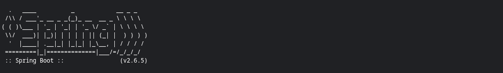
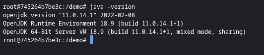
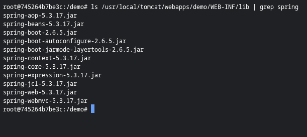
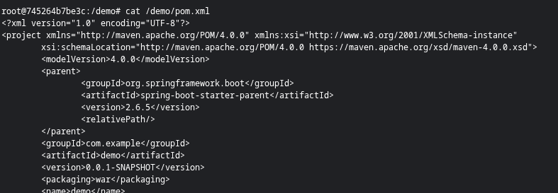
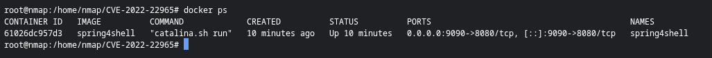
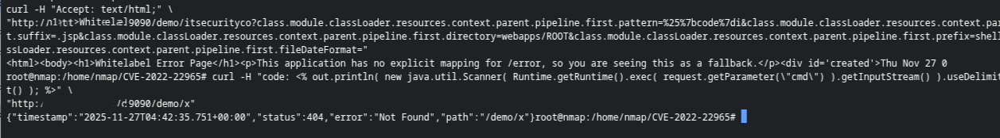
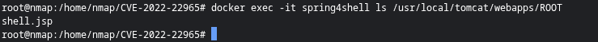
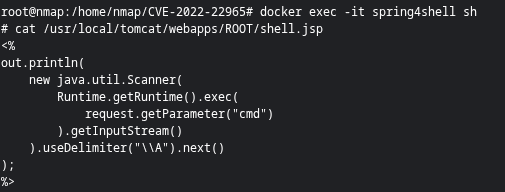
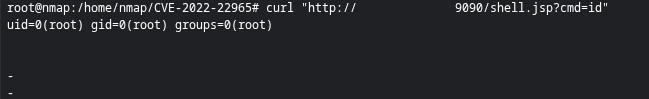

# CVE-2022-22965 – Spring4Shell RCE 재현 및 패치 검증

Spring Framework의 원격 코드 실행 취약점인 **CVE-2022-22965(Spring4Shell)** 을  
Docker 기반 Spring Boot 환경에서 실제로 재현하고,  
RCE 성공 및 패치 적용 이후 차단 여부까지 전 과정을 검증한 분석 문서입니다.

본 테스트는 Spring Boot 2.6.x + Spring Framework 5.3.x 기반 애플리케이션을 사용해  
Spring4Shell의 실제 악용 가능성과 패치 효과를 실험적으로 확인하는 데 초점을 두었습니다.

---

## ✔ 1. 실험 환경 구성

테스트 환경은 아래와 같이 구성했습니다:

- Spring Boot **2.6.5**
- Spring Framework **5.3.17**
- OpenJDK **11.0.14.1**
- Tomcat 9.x (embedded)
- Docker 기반 컨테이너 실행

컨테이너 기동 시 출력되는 Spring Boot 배너:



---

## ✔ 2. 실제 Spring / Java 버전 검증

컨테이너 내부에서 Java 버전을 확인한 결과:

openjdk version "11.0.14.1"
OpenJDK Runtime Environment 18.9




Spring 라이브러리 목록:

spring-aop-5.3.17.jar
spring-beans-5.3.17.jar
spring-core-5.3.17.jar
spring-webmvc-5.3.17.jar
spring-boot-2.6.5.jar




`pom.xml` 설정(취약 버전 확인):



---

## ✔ 3. Docker 애플리케이션 실행 상태

컨테이너가 정상적으로 올라온 상태:

CONTAINER ID IMAGE COMMAND PORTS
xxxxx spring4shell "catalina.sh run" 0.0.0.0:9090->8080/tcp




---

## ✔ 4. Spring4Shell PoC 공격 수행

Spring4Shell 공격은 WebDataBinder가 처리하는 property path를 조작하여  
**Tomcat AccessLogValve 설정을 내 마음대로 덮어쓰는 방식**으로 수행된다.

PoC 구조는 아래와 같다 (IP 제거됨):

curl -X POST http://[TARGET]/demo/itsecurityco
-H "Content-Type: application/x-www-form-urlencoded"
--data-urlencode "class.module.classLoader.resources.context.parent.pipeline.first.pattern=..."




요청 결과는 WhiteLabel Error Page 형태지만  
이 시점에서 **내부적으로 AccessLogValve override가 이미 수행된 상태**이다.

---

## ✔ 5. JSP 웹셸 생성 확인

공격이 성공했다면 Tomcat ROOT 디렉토리에 `shell.jsp`가 생성된다.

docker exec -it spring4shell ls /usr/local/tomcat/webapps/ROOT
shell.jsp




생성된 JSP 웹셸 내용 확인:



해당 JSP는 요청 파라미터 `cmd` 값을 OS 명령으로 실행하고 그 결과를 출력한다.

---

## ✔ 6. RCE 수행 결과 (성공)

웹셸을 통해 OS 명령 실행 테스트:

curl "http://[TARGET]/shell.jsp?cmd=id"


반환 결과:

uid=0(root) gid=0(root) groups=0(root)




→ **root 권한 명령 실행 성공 → RCE 완벽하게 재현됨**

---

## ✔ 7. 패치 적용 후 재공격 테스트 (차단됨)

Spring 공식 가이드에 따라 WebDataBinder 위험 필드 접근을 차단하기 위해  
다음과 같은 코드를 적용:

```java
@ControllerAdvice
public class GlobalBindingConfig {

    @InitBinder
    public void configureBinding(WebDataBinder binder) {
        binder.setDisallowedFields(
                "class.*",
                "Class.*",
                "module.*",
                "classLoader.*",
                "*.classLoader",
                "*.module",
                "*.class"
        );
    }
}

이후 동일 PoC 재수행:

JSP 생성 실패 및 404 응답:

결과:

JSP 생성 불가

AccessLogValve override 차단

RCE 재현 불가

→ 패치 적용 시 취약점이 완전히 차단됨을 확인
```
---

✔ 8. 최종 결론

본 실험을 통해 다음 사실을 명확히 검증할 수 있었다:

🔥 (1) Spring Boot 2.6.5 + Spring 5.3.17 환경은 Spring4Shell 영향 대상
🔥 (2) PoC 공격을 통해 실제로 JSP 웹셸 생성 및 RCE 성공
🔥 (3) WebDataBinder 필드 차단 패치 적용 후 동일 공격 완전 차단
🔥 (4) AccessLogValve override → JSP 생성 → OS 명령 실행 흐름이 실전과 동일하게 확인됨

즉, Spring4Shell은 조건만 갖춰지면 즉시 RCE로 직결되는 고위험 취약점이며,
Spring Framework 패치 및 바인딩 필터링 정책 적용 시 실질적인 대응이 가능함을 실험적으로 확인했다.


